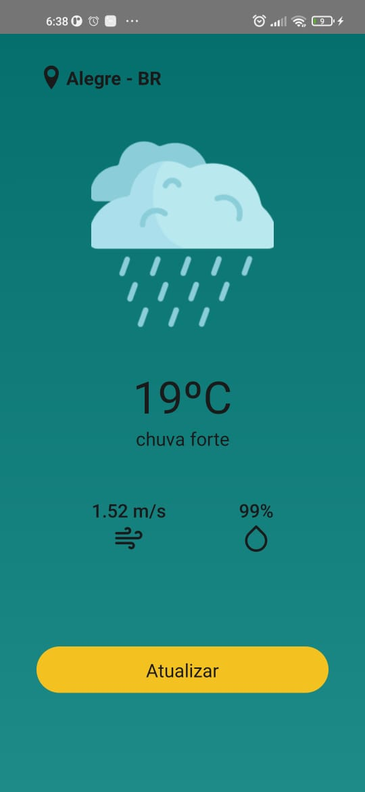

## 📱 Telas do projeto

<p align="center">
  
   
</p>

- Tela desenvolvida com base no [Figma](https://www.figma.com/file/UKeEKjUYTC7pzO0UiNqC3H/Untitled?node-id=0%3A1)

## 🚀 Tecnologias

Entre as tecnologias utilizadas, destaca-se:

 - [React Native](https://reactnative.dev/)
 - [Typescript](https://www.typescriptlang.org/)
 - [Styled-Components](https://styled-components.com/)
 - [Axios](https://www.npmjs.com/package/axios)
 - [React Native Vector Icons](https://github.com/oblador/react-native-vector-icons)
 - [React Navigation](https://reactnavigation.org/)
 - [React Native Linear Gradient](https://www.npmjs.com/package/react-native-linear-gradient)
 - [React Native Geolocation](https://github.com/react-native-geolocation/react-native-geolocation)
 
### 💻 Instalação

```bash
# Clone this repository
$ git clone https://github.com/HiagoScierry/openWeatherApp
# Go into the repository
$ cd openWeatherApp
# Install dependencies
$ yarn
# Start
$ yarn android 
```

